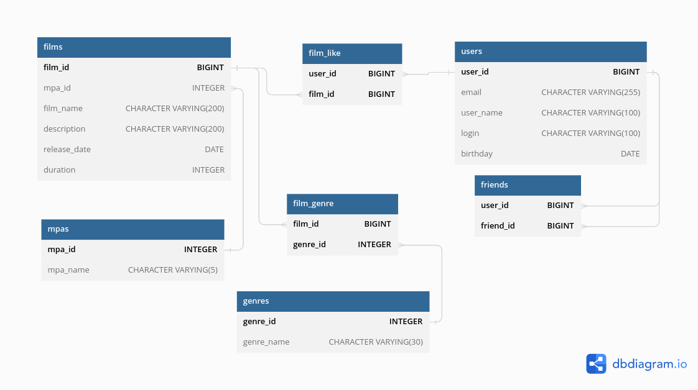

# java-filmorate
## Схемы базы данных

ссылка: https://dbdiagram.io/d/640a318b296d97641d86c87d
## Запросы
### Запросы для фильмов
- всех фильмов c лайками 
```roomsql
SELECT f.*, COALESCE(s.count_like, 0) AS count_of_likes
FROM films AS f
LEFT JOIN (SELECT fl.film_id, 
	COUNT(fl.user_id) AS count_like 
    FROM film_like AS fl
GROUP BY fl.film_id) AS s ON f.film_id=s.film_id;
```
- Получение фильмов которым пользователь поставил лайк
```roomsql
SELECT f.*
FROM film_like AS fl
JOIN films AS f ON fl.film_id=f.film_id
WHERE fl.user_id = 1;
```
- ТОП фильмов по рейтингу
```roomsql
SELECT f.*, COALESCE(s.count_like, 0) AS rate
FROM films AS f
LEFT JOIN (SELECT fl.film_id, 
			COUNT(fl.user_id) AS count_like 
    		FROM film_like AS fl
			GROUP BY fl.film_id 
		   	LIMIT 10) AS s ON f.film_id=s.film_id
ORDER BY rate DESC
LIMIT 10;
```
### Запросы для пользователей
- список друзей пользователя
```roomsql
SELECT * FROM users
WHERE user_id IN
(SELECT friend_id
FROM friends WHERE user_id=1)
```
- список общих друзей
```roomsql
SELECT * FROM users
WHERE user_id IN 
(SELECT friend_id
FROM friends WHERE user_id=1 
INTERSECT
SELECT friend_id
FROM friends WHERE user_id=2)
```